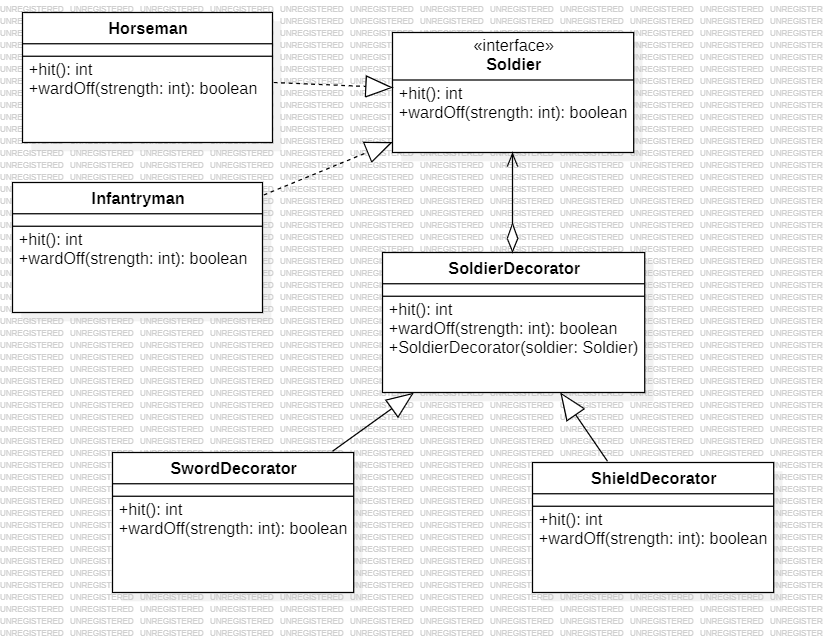

Lab 03 - Army Game.  
Thái Thiên Phú - 23120327

# Phần 1: Trang Bị Cho Binh Lính

## 1.1 Decorator Pattern class diagram

## 1.2 Decorator Pattern + Proxy Pattern class diagram

**Câu hỏi:** Theo Decorator Pattern, "chức năng của đối tượng trở nên phong phú hơn" – điều này có đúng trong trường hợp này không?

**Trả lời:** Đúng.

**Giải thích:**
* **Cơ chế hoạt động:** Thay vì dùng kế thừa (Inheritance) để tạo ra vô số lớp con cố định (ví dụ: SoldierWithSword, SoldierWithShield), mẫu thiết kế này sử dụng **Composition** (thành phần).
* **Phong phú về hành vi:** Khi một "Binh lính" được bao bọc (wrap) bởi một Decorator "Kiếm", đối tượng mới không chỉ giữ các hành vi cơ bản mà còn có thêm các thuộc tính hoặc phương thức của kiếm, ví dụ như tăng chỉ số attack hoặc thêm phương thức `slash()`.
* **Tính linh hoạt:** Bạn có thể thêm hoặc bớt các lớp chức năng này vào **thời điểm chạy (runtime)** mà không làm thay đổi cấu trúc của lớp gốc.
* **Trách nhiệm năng động:** Đối tượng được coi là "phong phú hơn" vì nó được tích hợp thêm các trách nhiệm mới một cách năng động.

---

**Câu hỏi:** Nếu có thêm ràng buộc: một binh lính không thể mang hai trang bị cùng loại – Decorator có phải là phương pháp thích hợp để đảm bảo ràng buộc này không?

**Trả lời:** Không phải là phương pháp thích hợp nhất.

**Lý do:**
* **Cấu trúc đệ quy (Recursive structure):** Decorator hoạt động theo kiểu "vỏ hành". Một lớp vỏ bên ngoài chỉ nhận diện đối tượng bên trong là một Component chung chung, nên khó biết được các lớp vỏ sâu hơn đã có loại trang bị đó hay chưa.
* **Vi phạm nguyên tắc "trong suốt" (Transparency):** Mục tiêu của Decorator là làm cho đối tượng được trang bị và đối tượng gốc trông giống hệt nhau về mặt giao diện. Việc bắt Decorator phải "kiểm tra ngược" vào bên trong sẽ làm tăng độ phức tạp và phá vỡ tính đóng gói.
* **Khó quản lý trạng thái:** Để kiểm tra loại trang bị, hệ thống phải duyệt qua toàn bộ chuỗi Decorator (traverse the chain), gây tốn kém hiệu năng và làm mã nguồn trở nên rắc rối.

---

# Phần 2: Tổ Chức Quân Đội
## 2.1 Composite Pattern + Visitor Pattern class diagram

# Phần 3: Theo Dõi & Quản Lý Trận Chiến
## 3.1 Observer Pattern + Singleton Pattern +  Abstract Factory Pattern class diagram

**Câu hỏi:** Giải thích tại sao việc giới hạn này lại có ý nghĩa trong bối cảnh theo dõi trận chiến.  
**Trả lời:**  
* **Tính nhất quán dữ liệu (Single Source of Truth):** Đảm bảo con số "tổng lính tử trận" là duy nhất và chính xác trên toàn hệ thống, tránh việc nhiều bộ đếm chạy độc lập gây sai lệch số liệu.

* **Tránh lặp thông báo:** Ngăn chặn việc người dùng nhận được 2-3 thông báo trùng lặp cho cùng một sự kiện một binh lính hy sinh (ví dụ: 3 thông báo "Lính A đã chết" cùng lúc).

* **Điểm truy cập toàn cục:** Cho phép bất kỳ thành phần nào trong game (UI, Logic kết thúc game) dễ dàng lấy dữ liệu báo cáo thông qua getInstance() mà không cần truyền tham số phức tạp.

* **Tiết kiệm tài nguyên:** Trận chiến có hàng ngàn quân lính (SoldierProxy), nhưng chỉ cần một thực thể theo dõi duy nhất để quản lý toàn bộ sự kiện.

# Phần 4: Tổng hợp toàn bộ hệ thống
## 4.1 Nhóm Mẫu Cấu Trúc (Structural Patterns)
### **Composite Pattern**
* **Thành phần:** `SoldierGroup`, `Soldier`.
* **Mô tả:** Cho phép xử lý một nhóm binh lính (`SoldierGroup`) tương tự như một binh lính đơn lẻ. Các phương thức như `hit()` và `wardOff()` được thực hiện đệ quy lên tất cả các thành viên trong nhóm.
* **Lợi ích:** Giúp quản lý quân đội theo cấu trúc cây (đại đội, tiểu đội, cá nhân) một cách đồng nhất.

### **Decorator Pattern**
* **Thành phần:** `SoldierDecorator` và các lớp con (`SwordDecorator`, `ArmorDecorator`, `RifleDecorator`, `LaserSwordDecorator`, ...).
* **Mô tả:** Cho phép thêm các tính năng hoặc chỉ số (tăng sát thương, giảm sát thương nhận vào) vào đối tượng `Soldier` một cách linh hoạt tại thời điểm thực thi (runtime) mà không làm thay đổi cấu trúc của lớp gốc.
* **Lợi ích:** Tránh việc bùng nổ số lượng lớp con (ví dụ: không cần tạo lớp `InfantrymanWithSwordAndShield`).

### **Proxy Pattern**
* **Thành phần:** `SoldierProxy`.
* **Mô tả:** Đóng vai trò lớp trung gian kiểm soát truy cập vào đối tượng thực (`innerSoldier`). Trong hệ thống này, nó thực hiện kiểm tra logic: chỉ cho phép trang bị (`equip`) những vật phẩm phù hợp với thời đại (`Era`) của binh lính đó.
* **Lợi ích:** Tách biệt logic kiểm tra ràng buộc ra khỏi logic chiến đấu cốt lõi.

---

## 4.2 Nhóm Mẫu Khởi Tạo (Creational Patterns)

### **Abstract Factory Pattern**
* **Thành phần:** Interface `SoldierFactory` và các factory cụ thể (`MedievalFactory`, `WorldWarFactory`, `ScienceFictionFactory`).
* **Mô tả:** Cung cấp một giao diện để tạo ra các họ đối tượng liên quan (Binh lính và Trang bị) theo từng thời đại mà không cần chỉ định chính xác các lớp cụ thể của chúng.
* **Lợi ích:** Đảm bảo tính nhất quán về thời đại cho toàn bộ quân đoàn được tạo ra.

### **Singleton Pattern**
* **Thành phần:** `DeathCountObserver`, `DeathNotifierObserver`.
* **Mô tả:** Sử dụng phương thức `getInstance()` và constructor `private` để đảm bảo mỗi lớp chỉ có duy nhất một thực thể trong suốt vòng đời ứng dụng.
* **Lợi ích:** Tập trung hóa việc quản lý thống kê tử trận và gửi thông báo, tránh việc tạo nhiều đối tượng gây lãng phí bộ nhớ hoặc sai lệch dữ liệu.

---

## 4.3 Nhóm Mẫu Hành Vi (Behavioral Patterns)

### **Visitor Pattern**
* **Thành phần:** Interface `SoldierVisitor`, các lớp cụ thể `CountVisitor`, `DisplayVisitor` và phương thức `accept()` trong `Soldier`.
* **Mô tả:** Tách biệt các thuật toán xử lý (như đếm số lượng từng loại quân, in báo cáo danh sách) ra khỏi cấu trúc phân cấp của các đối tượng lính.
* **Lợi ích:** Dễ dàng thêm các tính năng mới (ví dụ: `CalculateTaxVisitor`) mà không cần sửa đổi mã nguồn của các lớp `Soldier`.

### **Observer Pattern**
* **Thành phần:** `BattleSubject` (Subject) và `DeathObserver` (Observer).
* **Mô tả:** Thiết lập mối quan hệ một-nhiều. Khi một sự kiện xảy ra (binh lính tử trận), `BattleSubject` sẽ thông báo cho tất cả các `Observer` đã đăng ký (`DeathCountObserver` để tăng biến đếm, `DeathNotifierObserver` để gửi email).
* **Lợi ích:** Tạo ra sự liên kết lỏng lẻo (loose coupling) giữa các thành phần thông báo và logic chiến đấu.